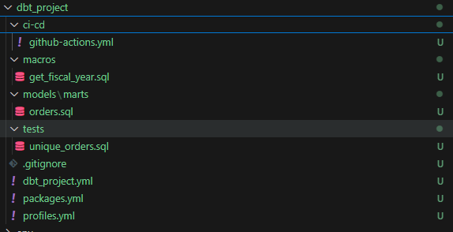

# dbt-cookiecutter-sp

## Project Overview
This is a production-ready dbt project template using Cookiecutter.

## Environments
- **dev**: For development work.
- **staging**: For testing before production.
- **prod**: Live production data.

## Run dbt Commands
```sh
dbt run --target prod
dbt test --target prod

## Create standard dbt project using cookiecutter

dbt-cookiecutter-sp>cookiecutter https://github.com/sanket1203/dbt-cookiecutter-sp
You've downloaded C:\Users\SANKET\.cookiecutters\dbt-cookiecutter-sp before. Is it okay to delete and re-download it? [y/n] (y): y
  [1/10] project_name (My Production dbt Project): dbt_project
  [2/10] project_slug (dbt_project): 
  [3/10] dbt_version (1.6.0): 
  [4/10] profile_name (dbt_project_profile): 
  [5/10] Select environment
    1 - dev
    2 - staging
    3 - prod
    Choose from [1/2/3] (1): 1
  [6/10] target_schema (analytics):  
  [7/10] database (your_database):
  [8/10] threads (8):
  [9/10] warehouse (your_warehouse):
  [10/10] ci_cd_enabled (true):

 